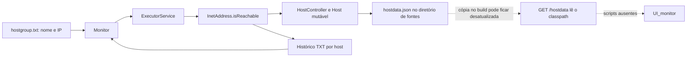
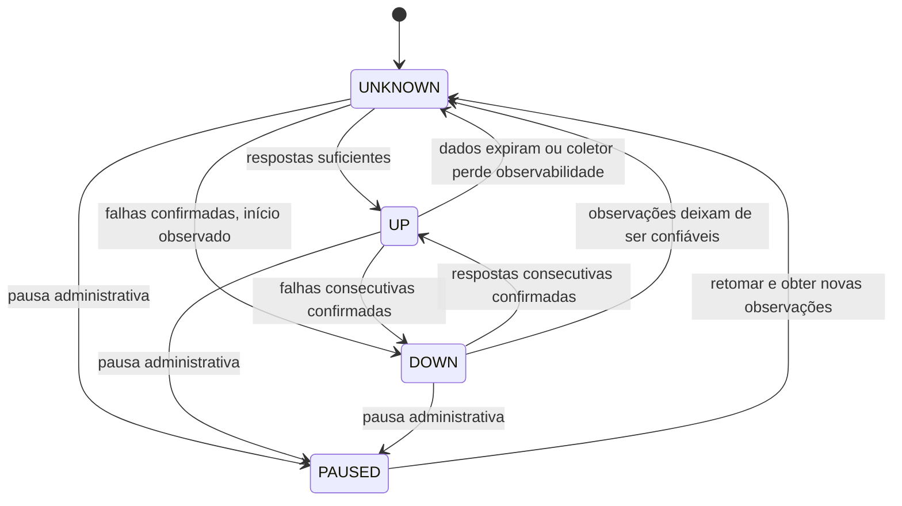
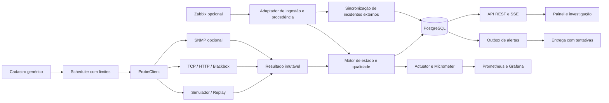

# Análise e plano — portfólio de gestão e investigação de circuitos

Análise realizada em 08/10/2026 sobre os fontes e dados presentes neste checkout. O documento reúne a auditoria original, o planejamento e o acompanhamento da implementação. As seções 2 a 5 descrevem o estado anterior às mudanças; a seção 20 registra o primeiro marco e a seção 24 acompanha a persistência/cadastro implementados em 09/10/2026.

Direção atualizada a partir do relato do autor: o objetivo é apresentar um projeto de portfólio baseado em uma necessidade real de um analista de redes, com prioridade para investigação orientada, gestão de operadoras, visibilidade de redundância e operação simples. As recomendações técnicas anteriores ficam subordinadas a esse recorte; extensões operacionais não são requisitos para concluir a primeira versão apresentável.

## 1. Conclusão e direção recomendada

O projeto original tem uma base aproveitável em Java e Spring Boot, mas apresenta defeitos de inicialização, concorrência, cálculo, persistência e integração com a interface. A evolução implementou um novo núcleo, uma demo independente e persistência/cadastro genéricos. A interpretação de redundância, os resumos para operadoras e a nova interface continuam previstas nos próximos marcos.

A proposta de portfólio é **transformar dados de monitoramento em informações claras para investigar incidentes e administrar circuitos de organizações com várias unidades**. O valor demonstrado será a passagem de medições para uma decisão compreensível: qual unidade foi afetada, qual circuito tem problema, desde quando, quais evidências sustentam isso e qual ação merece ser investigada.

A recomendação técnica permanece Java/Spring Boot, monólito modular, cadastro genérico, PostgreSQL e atualização por eventos. A origem dos dados deve ficar separada da interpretação e da interface, permitindo simulação, coleta própria e futura integração externa. O painel não precisa conhecer se uma medição veio de uma sonda local ou de outra plataforma, mas deve preservar a origem e a semântica da evidência.

O autor confirmou como objetivo demonstrar **backend, concorrência e regras de monitoramento**, mantendo o contexto que originou o projeto. Portanto, a coleta própria controlada, o processamento paralelo e o motor de estados são parte central da primeira versão. A simulação permite verificar essas habilidades sem depender de redes externas; a interface apresenta seus resultados de forma compreensível. A integração com Zabbix permanece uma extensão.

Para a primeira apresentação, usar uma demo com cerca de 12 circuitos, seis unidades e três operadoras fictícias, incluindo pares de links em unidades selecionadas. Um servidor e dados sintéticos bastam para demonstrar o produto. Até 500 circuitos passa a ser uma hipótese de teste de carga futuro, não requisito nem capacidade comprovada da primeira versão.

Uma decisão de domínio é essencial: testar um IP indica a acessibilidade daquele destino a partir de uma origem. Para afirmar algo sobre um circuito específico, é necessário associar a medição à origem, à rota/interface e ao destino desse circuito. Um link secundário pode cair enquanto o destino continua acessível pelo link principal.

### 1.1 Origem do projeto e interpretação do caso

Segundo o relato do autor, o projeto surgiu da dificuldade de um servidor público que atuava como analista de redes em interpretar gráficos, listas de ping e outros dados fornecidos pelo Zabbix. Ele escolheu desenvolver um monitoramento externo próprio para apresentar as informações que precisava. Esse relato é a motivação do projeto; não constitui uma avaliação medida da instalação utilizada nem uma demonstração de ausência de recursos no Zabbix.

A hipótese mais útil é que existia uma distância entre os dados disponíveis e as perguntas operacionais do analista. É possível ter métricas corretas e ainda precisar cruzar telas, lembrar nomes de circuitos, calcular durações e reunir evidências manualmente. Isso justifica investigar uma experiência específica para o trabalho do usuário. Não há informação suficiente para atribuir a dificuldade à ferramenta, à configuração, às permissões, à formação do usuário ou a uma combinação desses fatores.

O Zabbix permite montar [dashboards com widgets](https://www.zabbix.com/documentation/current/en/manual/web_interface/frontend_sections/dashboards) e oferece uma [API para integrações](https://www.zabbix.com/documentation/current/en/manual/api). Portanto, ajustar o dashboard ou construir uma aplicação auxiliar consumindo os dados existentes seriam caminhos plausíveis. Isso não prova que estavam disponíveis ou seriam suficientes na situação original.

| Caminho | Benefício | Custo e limite |
| --- | --- | --- |
| Ajustar a visualização no Zabbix | Aproveita a coleta e a operação existentes com menos componentes novos | Depende de acesso, configuração e capacidade de representar o fluxo desejado. |
| Criar uma aplicação auxiliar com API do Zabbix | Permite experiência e relatórios próprios reutilizando observações existentes | Exige integração, mapeamento de circuito/item/evento e atenção à semântica e à versão da API. |
| Implementar coleta independente | Dá autonomia ao protótipo e permite demonstrar backend, concorrência e regras sem a instalação institucional | Introduz manutenção de sondas, falsos positivos, armazenamento e possível divergência entre monitores. |

Minha avaliação: a coleta própria é compreensível como solução local e tem valor didático para o portfólio. Ela não resolve automaticamente a dificuldade de interpretação; essa melhoria depende do desenho da informação. Numa organização que já tem coleta confiável e acesso autorizado à API, reutilizar os dados seria a primeira alternativa a avaliar, inclusive para evitar monitoramento duplicado. Sem conhecer as restrições da época, não cabe concluir que a escolha do analista foi errada.

A evolução proposta mantém autonomia para a demo e coleta controlada, mas prepara um adaptador externo. A narrativa do portfólio deve descrever o problema observado, as decisões e os limites, sem afirmar superioridade sobre o Zabbix ou um ganho de produtividade que ainda não foi medido.

### 1.2 Quatro pilares do produto

| Pilar | Pergunta do usuário | Primeira funcionalidade demonstrável | Evidência para o portfólio |
| --- | --- | --- | --- |
| Investigação orientada | O que aconteceu e quais dados ajudam a investigar? | Resumo do incidente, linha do tempo, evidências e verificações sugeridas | Explicar uma queda, uma degradação e uma ausência de observação sem confundi-las. |
| Gestão de operadoras | Qual contrato/circuito foi afetado e o que informar à operadora? | Agrupamento por provedor e resumo exportável do incidente | Gerar um relato com unidade, referência contratual fictícia, horários, duração e evidências. |
| Visibilidade de redundância | A unidade está sem conectividade ou perdeu um dos links? | Relação entre links principal/secundário e disponibilidade observada da unidade | Exibir unidade acessível com link secundário fora e risco de perda de redundância. |
| Operação simples | Onde devo olhar e como começo a acompanhar um circuito? | Cadastro curto, visão de problemas prioritários e acesso direto ao detalhe | Concluir os fluxos principais sem interpretar listas brutas de ping nem configurar vários gráficos. |

Facilidade de leitura é um requisito transversal. Mais gráficos só entram quando respondem a uma pergunta identificável; a tela principal não deve transferir ao usuário o trabalho de recompor o incidente.

### 1.3 Escopo da primeira versão de portfólio

**Obrigatório:** cadastro de unidade/circuito/operadora, demo reproduzível, resultados e incidentes confiáveis, resumo operacional, tabela focada em problemas, detalhe com evidências, relação entre links redundantes, resumo exportável para operadora, atualização dinâmica e indicação de dados antigos. Incluir uma coleta TCP/HTTP local controlada para demonstrar o mecanismo real, sem depender dos destinos antigos. A documentação de execução, testes e decisões faz parte da entrega.

**Extensões:** integração real com Zabbix, ICMP externo, SNMP/banda, alertas em canais externos, autenticação com vários papéis, coleta distribuída, mapa geográfico, topologia e testes para centenas de circuitos. Recursos que ainda não existem devem aparecer como planejados. Autorização/autenticação torna-se necessária antes de disponibilizar ações e dados reais a usuários externos; uma demo pública de portfólio deve usar dados sintéticos e escopo controlado.

Não incluir um sistema completo de chamados ou automação de diagnóstico na primeira versão. O resumo exportável pode alimentar um chamado existente. Reconhecimento e comentário local do incidente são suficientes para mostrar continuidade do atendimento.

### 1.4 Como avaliar a facilidade de uso

Validar tarefas concretas: identificar a unidade afetada, localizar a primeira evidência, distinguir falha do circuito de falta de observação, perceber perda de redundância e preparar o resumo para a operadora. Observar se o usuário consegue concluir cada tarefa, quanto tempo leva e quais interpretações incorretas faz.

Se possível, realizar sessões curtas com profissionais de redes; se não houver acesso, registrar a revisão como avaliação interna, sem chamá-la de validação com usuários. Uma meta inicial a testar é identificar o problema prioritário em até 30 segundos e preparar o resumo do incidente em até dois minutos. São metas propostas, não resultados obtidos. Comparações com o fluxo antigo só devem ser publicadas se forem medidas em condições descritas.

## 2. Estado original analisado

Esta seção documenta o checkout antes da implementação. As versões, o endpoint e o fluxo originais abaixo foram substituídos no perfil de demonstração conforme a seção 20. Os fontes antigos continuam disponíveis como referência.

| Parte | Evidência | Situação |
| --- | --- | --- |
| Backend | `API_monitor/pom.xml:6-19` | Spring Boot **3.1.2**, Java **17**, Maven. |
| Entrada HTTP | `MonitoramentoApplication.java:8-12` | Aplicação Spring Boot com Spring Web. |
| Entrada alternativa | `MonitoramentoServer.java:12-32` | Executa o monitor manualmente em uma thread, fora da inicialização da aplicação HTTP. |
| Monitor | `controller/Monitor.java` | Cadastro por TXT, reconstrução dos contadores, execução paralela, gravação em TXT e JSON. |
| Sonda | `controller/PingAndWriteService.java:40-53` | Usa `InetAddress.isReachable(2000)`; não lê uma saída de comando `ping`. |
| Cálculos | `controller/HostController.java:19-57` | Contadores de testes/falhas/quedas e timestamps da última queda e volta. |
| Modelo | `model/Host.java` | Identificação, IP e contadores mutáveis; ausência de estado explícito, incidente e histórico consultável. |
| API | `controller/DataController.java:16-28` | Apenas `GET /hostdata`, que lê um JSON do classpath. |
| Interface | `UI_monitor/index.html` e CSS | HTML, Bootstrap, estilos para DataTables e indicação UP/DOWN. |
| JavaScript | Entrada Git `UI_monitor/assets/js` | Gitlink em modo `160000`; diretório vazio neste checkout e ausência de `.gitmodules`. |
| Testes | `MonitoramentoApplicationTests.java` | Apenas `contextLoads`, sem testes das regras de monitoramento. |
| Configuração | `application.properties` | Praticamente vazia: um byte. |
| Persistência/segurança | Dependências e fontes | Sem banco, migrações, autenticação, políticas de retenção ou alertas implementados. |

Foram lidos os oito arquivos Java de produção, o único teste, o POM, o wrapper, as configurações, o HTML, o CSS próprio e a estrutura do repositório. As bibliotecas CSS minificadas foram identificadas como recursos de terceiros. Os scripts de `.github/modernize/java-upgrade` são auxiliares de modernização, não uma implementação de CI de build e testes. As pastas `target` contêm artefatos compilados versionados, que não substituem a análise dos fontes.

### Fluxo original



A descrição de que o projeto lê arquivos de ping está parcialmente correta: ele lê os TXT históricos para reconstruir contadores, mas também realiza novas verificações e escreve os próprios TXT. As duas entradas de execução não estão integradas.

## 3. Auditoria dos dados históricos

| Verificação | Resultado |
| --- | ---: |
| Circuitos no cadastro | 128 |
| Arquivos individuais de histórico | 128 |
| Nomes duplicados no cadastro | 0 |
| IPs distintos | 127 |
| Arquivos sem cadastro / cadastros sem arquivo | 0 / 0 |
| Volume dos TXT | 72.873.390 bytes, aproximadamente 69,5 MiB |
| Linhas totais | 2.913.513 |
| Linhas no formato estrito de sete campos numéricos | 2.906.400 |
| Linhas com campos adicionais | 7.113 |
| Respostas zero entre linhas no formato estrito | 499.503 |
| Repetições de timestamp dentro do mesmo arquivo | 76.426 |
| Recuos de timestamp entre registros consecutivos no formato estrito | 118 |
| Intervalos entre registros consecutivos superiores a 60 segundos | 22.097 |
| Arquivos cuja primeira medição indica zero | 7 |
| Faixa temporal dos registros no formato estrito | 07/07/2023 a 31/08/2023 |
| Registros no JSON atual | 128, dentro de objetos com chave `host` |

Os números têm critérios diferentes explicitados na tabela: as repetições e os intervalos foram contados incluindo linhas extras cujo timestamp e sétimo campo ainda eram interpretáveis. Nenhuma dessas linhas provocou erro ao interpretar somente a data e o sétimo campo; o problema é que o leitor deixa informação de fora.

Exemplo real sem identificadores: `2023-07-22-19-38-28-0001-0000`. O código pega somente `split("-")[6]` e trata essa linha como resposta de 1 ms; não interpreta o campo final. Não há informação suficiente para afirmar por que esse campo existe. A migração deve preservar a linha original e submetê-la a uma regra explícita de normalização ou quarentena.

Repetição de timestamp não prova duplicação da medição: o formato tem precisão de segundos. É necessário distinguir múltiplas observações no mesmo segundo, linhas efetivamente duplicadas e execução simultânea de produtores. Não excluir registros só por compartilharem o timestamp. Os 127 IPs para 128 nomes também exigem validação: pode existir compartilhamento legítimo ou erro de cadastro.

Os históricos podem servir para reprodução de cenários e análise de qualidade da importação. Não representam o estado atual das redes e não permitem inferir automaticamente a disponibilidade de todo o período entre julho e agosto. Existem intervalos sem observação.

## 4. Defeitos e riscos no código

### 4.1 Inicialização e continuidade — prioridade P0

**Monitor não inicia pelo Spring.** `Monitor.java:25` implementa `ApplicationRunner`, mas não está registrado com `@Component`, `@Service` ou `@Bean`. O ponto de entrada Spring não instancia `MonitoramentoServer`. Iniciar `MonitoramentoApplication` disponibiliza o controlador HTTP, mas, pelo código fornecido, não liga a coleta.

**Duas entradas independentes.** `MonitoramentoServer.java:22-27` chama um método que já contém um laço prolongado e, depois, adiciona outro laço externo e um sleep. O lock não protege os objetos alterados pelos executores internos e fica retido durante o laço de coleta. Não oferece uma solução para a concorrência das medições.

**Monitor termina por limite artificial.** `Monitor.java:32,49` encerra cada execução após 10.000 ciclos. Com o sleep de dez segundos, isso representa nominalmente cerca de 27,8 horas, além do trabalho executado. A entrada alternativa volta a chamar o método e reconstrói objetos; um eventual runner integrado executaria apenas uma chamada. Remover esse limite e adotar ciclo de vida gerenciado, com parada e reinício controlados.

**Interrupções ignoradas.** Os catches apenas imprimem a exceção; não restauram o sinal de interrupção nem encerram o laço. `shutdown()` não aguarda as tarefas, e `stopPingHosts()` não administra os executores da classe. Implementar cancelamento, prazo de encerramento e tratamento da parada do Spring.

Adicionar somente `@Component` não resolve esses problemas: o runner passaria a executar um laço de longa duração durante a inicialização. A coleta deve ser agendada de forma assíncrona e integrada ao ciclo de vida da aplicação.

### 4.2 Concorrência — prioridade P0

**Resultado de um circuito pode ser atribuído a outro.** `PingAndWriteService.java:11-20` guarda `timestamp` e `responseTime` em campos da mesma instância usada por todas as tarefas. Uma thread pode sobrescrever esses campos antes de outra atualizar o host ou gravar a linha. Usar variáveis locais e resultados imutáveis; não basta tornar os campos `volatile`.

**Histórico e coleta atual podem alterar o mesmo objeto simultaneamente.** `Monitor.java:78-105` inicia tarefas de reconstrução e faz apenas `shutdown()`, sem esperar a conclusão. O método principal segue para a coleta. `HostController` faz operações de leitura, incremento e escrita sem exclusão mútua. Os contadores e timestamps podem refletir ordem errada ou perder atualizações.

**JSON é produzido sem snapshot consistente.** A serialização lê objetos enquanto as tarefas os alteram. O sleep de dez segundos não garante término das sondas. Uma resposta pode combinar contadores e timestamps de momentos diferentes.

**Threads sem limite explícito.** Há dois `newCachedThreadPool()`. Além de ausência de limite, não existe impedimento de sobreposição de coletas do mesmo circuito, fila controlada ou política de sobrecarga. A resolução DNS também ocorre antes do timeout do teste de acessibilidade. Separar prazo de DNS, conexão e prazo total de execução.

A estrutura `HashMap` não é, por si só, a causa de todos esses problemas: no fluxo usual ela é preenchida antes da submissão das tarefas. O problema comprovado é a mutabilidade concorrente dos valores. Usar `ConcurrentHashMap` sozinho não corrige as regras de atualização.

### 4.3 Cálculos e interpretação — prioridade P0

**Zero significa falha e também pode ser duração válida.** `PingAndWriteService.java:43-48` mede o tempo com precisão de milissegundos. Uma resposta rápida pode resultar em zero e ser classificada como queda por `HostController.java:38`. Separar `outcome` de `latencyMs`, admitindo latência decimal e `null` quando não houve resposta.

**Primeira falha desaparece dos contadores.** `HostController.java:37` só processa uma falha quando `nping > 0`. Na primeira observação com zero, incrementa o total, mas não o total de falhas e não define início de indisponibilidade. Registrar a primeira falha; se não houve estado UP anterior, marcar incidente como indisponibilidade observada desde o início, sem inventar uma transição UP → DOWN.

**Mês de outro ano entra no mês atual.** As linhas 44 e 54 comparam só o número do mês. `timenow` é estático e calculado uma única vez. Outubro de 2025 pode entrar nos contadores de outubro de 2026, e um processo atravessando a virada de mês não atualiza a referência. Calcular por intervalo temporal e timezone, com `YearMonth` quando necessário.

**Eventos antigos sobrescrevem o estado atual.** `addInfoHost` aceita qualquer timestamp e atualiza a última medição. Há registros fora de ordem no histórico. Importação deve ordenar/normalizar o histórico separadamente; ingestão ao vivo deve impedir que resultado atrasado substitua um estado mais recente.

**Uma falha isolada já é queda.** Não há confirmação por sequência, tempo mínimo ou política específica de teste. Há risco de excesso de incidentes e alertas em redes com perda ocasional. Introduzir confirmação de queda e recuperação, com parâmetros por circuito.

**Histórico de incidentes não existe.** Há somente última queda, última volta e contadores. Não se calcula nem persiste a duração de cada incidente, soma de indisponibilidade por janela, disponibilidade, p95 ou oscilação. A duração não deve depender de um contador multiplicado por dez segundos, pois o intervalo real varia.

**Falhas do monitor parecem falhas do circuito.** Qualquer `IOException` na coleta vira zero. DNS inválido, permissão insuficiente, problema do coletor e destino inacessível ficam indistinguíveis. Adotar resultados categorizados e regras por protocolo para decidir quais falhas são evidência do destino e quais representam ausência de observação confiável.

**`isReachable` é uma verificação de melhor esforço.** Pode usar ICMP ou tentar TCP na porta 7, dependendo da implementação e dos privilégios. Firewalls podem bloquear o teste e permitir outros serviços. Isso é documentado pela [Oracle para Java 17](https://docs.oracle.com/en/java/javase/17/docs/api/java.base/java/net/InetAddress.html). A duração medida inclui resolução de nome e execução da chamada; não é um RTT ICMP rigorosamente isolado.

**Relógio inadequado para medir duração.** `System.currentTimeMillis()` está sujeito a ajustes do relógio. Usar tempo monotônico, como `System.nanoTime()`, para medir execução; `Instant` para timestamps. Em `time()`, várias chamadas a `LocalDateTime.now()` podem até compor partes de instantes distintos numa virada de data.

**Modelagem frágil.** Contadores inteiros são `double`, timestamps são strings e a indisponibilidade é deduzida de uma medida numérica. Usar contadores `long`, tipos temporais e estados explícitos. Nomes JSON `lastDownIndex`/`lastUpIndex` não comunicam que armazenam timestamps.

### 4.4 Persistência e API — prioridade P0/P1

**Produtor e consumidor usam caminhos diferentes.** `Monitor.java:183` escreve no diretório dos fontes; `DataController.java:21-22` lê o classpath, normalmente `target/classes` durante execução local. Não há atualização automática garantida entre essas cópias.

**Empacotamento em JAR não funciona como arquivos comuns.** `resource.getFile()` exige um recurso disponível como arquivo físico. A estratégia não é adequada a recursos dentro do JAR. Mesmo trocar por stream só corrigiria a leitura de um recurso estático, não a persistência dinâmica. Dados mutáveis precisam de banco ou volume externo.

**Leitura pode ocorrer no meio da escrita.** `mapper.writeValue` reescreve o JSON inteiro sem publicação atômica. Se o leitor acessar esse mesmo arquivo enquanto é escrito, pode receber conteúdo parcial. Durante transição, escrever arquivo temporário e publicá-lo por troca atômica no mesmo filesystem, quando suportado; a solução final é consultar o estado persistido e seus DTOs.

**Erros HTTP não são estruturados.** `getHostData()` pode devolver uma mensagem textual com tipo anunciado de JSON e status HTTP padrão de sucesso. Usar DTO, `ResponseEntity`, códigos adequados e tratamento centralizado de erros.

**Leitura integral dos históricos.** `Files.readAllLines` carrega cada arquivo inteiro e entrega a lista a uma tarefa, sem limitar quantas listas ficam pendentes. O custo aumenta com o tempo, e o início do monitor depende de todo o passado. Fazer importação por streaming/lotes; não reconstruir toda a operação a cada boot.

**Cadastro preso ao filesystem.** Os caminhos relativos dependem do diretório de execução. `file.listFiles()` é avaliado na construção da classe, pode retornar `null` e fica desatualizado. O leitor de cadastro não valida comentários, linhas inválidas, nomes, destinos ou políticas.

**Gerência de arquivos não reporta todas as falhas.** `createDirHost` e `createFile` podem retornar sucesso após capturar uma exceção. Métodos de renomear/criar arquivos não são um contrato de gerenciamento de circuitos. Separar importação legada de cadastro de domínio.

**Ausência de limites e autorização.** CORS está aberto a qualquer origem, não há usuários/papéis e a API não tem filtros ou paginação. No cadastro genérico futuro, controlar também quais destinos cada usuário/coletor pode monitorar. Esse controle deve permitir redes privadas autorizadas, que são um uso legítimo do produto.

### 4.5 Interface e manutenção — prioridade P1

O HTML referencia seis arquivos JS ativos que não estão disponíveis. O cabeçalho e o corpo da tabela estão vazios e dependem desses scripts. A entrada Git do diretório JS aponta para outro repositório, sem configuração de submódulo neste checkout. Não é possível analisar a lógica de atualização/renderização que deveria existir em `script.js`.

Não há, no código disponível, painel dinâmico funcional, gráfico, tela de cadastro, detalhamento, histórico, tratamento de desconexão ou indicação de dado antigo. O CSS sugere uma tabela UP/DOWN e botões de exportação, mas não implementa essas funções.

`target` e logs operacionais estão versionados. Planejar `.gitignore`, dados demonstrativos pequenos e separação de dados históricos do código. Os nomes/IPs institucionais devem ser preservados apenas onde forem necessários; a demo pode usar identidades sintéticas. A análise não removeu nenhum arquivo existente.

## 5. Verificações realizadas e limites

Foi compilado em diretório temporário um programa de verificação que usa os fontes originais de `Host` e `HostController`. Nenhuma sonda de rede foi executada. Foram reproduzidos:

1. Primeira falha: total de testes = 1, total de falhas = 0, início de queda ausente.
2. Medição do ano anterior, no mesmo número de mês: contabilizada no mês atual.
3. Sequência UP, DOWN, DOWN, UP, DOWN: duas quedas imediatas, sem confirmação temporal.
4. Resultado com data anterior: substitui a última medição e pode registrar recuperação anterior à queda.
5. Resultado numérico zero: sempre interpretado como falha, pois o contrato não contém um indicador de sucesso.

A auditoria percorreu todos os 128 TXT e verificou o cadastro e o JSON. A condição de corrida entre threads foi identificada pela inspeção do fluxo e dos campos compartilhados; não foi medida como frequência de corrupção em execução real.

O ambiente possui JDK 21.0.6, enquanto o POM declara Java 17. Maven não está no PATH; foi encontrado Maven 3.9.9 no cache do wrapper, diferente do 3.9.3 indicado pelo projeto. Uma tentativa de testes Maven em modo offline, com repositório temporário isolado, parou antes da compilação porque o parent Spring Boot 3.1.2 não estava disponível nesse repositório. O cache padrão inspecionado contém o parent 3.4.3, não o 3.1.2. Portanto, o build completo e o teste Spring não foram validados; esse resultado não demonstra um erro de compilação nos fontes.

Não foram contatados os IPs históricos. Sem acesso à rede original e sem os JavaScript ausentes, não é possível validar o comportamento operacional antigo nem o fluxo completo no navegador.

## 6. Modelo genérico de circuitos

Um circuito precisa de identidade própria, independente do nome da unidade ou do nome do arquivo. Recomenda-se separar:

| Entidade | Responsabilidade e campos principais |
| --- | --- |
| `Site` e `Provider` | Unidade e operadora com identidades próprias; contatos e referências fictícias na demo. Permitem agrupamentos sem depender de convenções de nomes. |
| `Circuit` | UUID, nome, descrição, tipo, unidade/local, provedor, referência contratual, capacidade contratada de entrada/saída, criticidade, tags e ativo. |
| `ConnectivityGroup` | Relação entre circuitos que atendem à mesma unidade/serviço, papel principal/secundário, política de redundância e evidências disponíveis sobre conectividade e caminho ativo. |
| `ProbeDefinition` | Circuito, coletor/origem, protocolo, destino, porta/URL/interface de rede, intervalo, prazo total, limites de qualidade e política de confirmação. |
| `Collector` | Identidade, rede/origem, saúde, versão, última comunicação e capacidades. Inicialmente representa o coletor local. |
| `ProbeResult` | Identificador da execução, circuito/sonda/coletor, início/fim, outcome, categoria de falha, duração/latência, sequência, metadados do protocolo, fonte do dado e versão da configuração. |
| `CircuitStatus` | Estado materializado, qualidade, última observação confiável, idade dos dados, contadores da confirmação pendente e versão. |
| `Incident` | Circuito, tipo, primeira evidência, confirmação, recuperação, severidade, limite da observação, reconhecimento, causa informada, evidências e identificação da fonte externa quando existir. |
| `MaintenanceWindow` | Intervalo, circuitos abrangidos, motivo e regra para alertas/SLA. |
| `AlertPolicy` e `AlertDelivery` | Regras, destinatários/canais, tentativas, deduplicação, escalonamento e confirmação de envio. |
| `MetricAggregate` | Janelas de 1/5 minutos e hora, quantidade de medições, sucessos/falhas, latência, disponibilidade e cobertura. |

Exemplo de configuração nova, proposto e ainda não implementado:

```json
{
  "name": "Link de internet da filial A",
  "type": "WAN",
  "site": "Filial A",
  "provider": "Operadora exemplo",
  "contractedDownloadMbps": 100,
  "contractedUploadMbps": 100,
  "tags": ["internet", "critico"],
  "probes": [
    {
      "protocol": "ICMP",
      "target": "192.0.2.10",
      "collectorId": "coletor-local",
      "intervalSeconds": 10,
      "timeoutMillis": 2000,
      "failureThreshold": 3,
      "recoveryThreshold": 2
    }
  ]
}
```

O endereço é ilustrativo, não um alvo real para coleta. Campos institucionais viram metadados opcionais. Um circuito pode ter várias sondas, e cada uma mede algo diferente. Ter acesso a um site HTTP não deve mascarar uma interface WAN indisponível. A política de agregação precisa definir quais sondas são essenciais, complementares ou de diagnóstico.

No caso de redundância, separar acessibilidade da unidade, saúde de cada link e confirmação do caminho ativo. Dois links respondendo não comprovam failover, diversidade física ou capacidade suficiente após uma falha. Sem telemetria/rota apropriada, mostrar "links configurados como redundantes; caminho ativo não confirmado". A demo pode simular explicitamente essas evidências, sempre identificando que são sintéticas.

## 7. Regras de estado e de incidente

Separar três dimensões:

- **Disponibilidade:** `UNKNOWN`, `UP`, `DOWN`, `PAUSED`.
- **Qualidade:** `UNKNOWN`, `GOOD`, `DEGRADED`.
- **Contexto:** manutenção, confirmação pendente, oscilação e reconhecimento do incidente.

A UI pode exibir “Degradado” como status visual, sem misturar degradação com indisponibilidade no cálculo de SLA. Manutenção também deve ser visível independentemente de o circuito estar respondendo.

Política inicial proposta: três falhas elegíveis consecutivas para confirmar DOWN e duas respostas para confirmar recuperação. Limites diferentes podem ser necessários para diferentes protocolos. Guardar `firstFailureAt`, `downConfirmedAt`, `firstRecoveryAt` e `recoveryConfirmedAt`.

Com coletas a cada dez segundos, a confirmação depende da fase do agendamento, das três tentativas, de seus tempos de execução e da fila. Não prometer queda exata em trinta segundos. Medir o atraso ponta a ponta no teste de carga.



Regras complementares:

1. Estado inicial UNKNOWN; nunca assumir UP por falta de dados.
2. Um teste concluído sem resposta pode fornecer evidência de indisponibilidade. Teste não executado, erro de configuração ou perda do coletor fornecem ausência de observação, não uma queda comprovada do circuito.
3. Definir expiração pela expectativa de coleta, prazo total e tolerância configurada. Um resultado antigo não mantém UP indefinidamente.
4. Se o monitor inicia e o circuito está fora, registrar “indisponível desde o início da observação”. O horário anterior da queda é desconhecido.
5. A queda real ocorreu entre a última resposta e a primeira falha, se houve observação contínua. Exibir “queda detectada” e manter esses limites em vez de afirmar precisão que o teste não tem.
6. Um incidente permanece identificado durante a recuperação pendente; fechá-lo apenas após confirmação. Repetições de falha não abrem novos incidentes.
7. Oscilação é medida por transições em uma janela; aplicar uma política própria para alertar sobre instabilidade.
8. Um resultado atrasado é armazenado como evidência, mas não pode retroceder o estado ao vivo. A reprodução histórica usa seu próprio processamento temporal.
9. Persistir medição, atualização do estado e abertura/fechamento de incidente de forma consistente, em transação. Entregas de alertas ficam em fila persistida/outbox e são tentadas depois.
10. Após reinício, recuperar estado/incidente persistido e registrar o intervalo sem coleta como desconhecido. Um incidente ainda aberto não prova que todo esse intervalo permaneceu DOWN.
11. Em manutenção, continuar coletando quando possível e silenciar notificações conforme política. A exclusão de manutenção do SLA deve ser uma opção contratual explícita.
12. Aplicar políticas por origem. Uma falha do gateway comum ou coletor pode explicar vários circuitos; indicar correlação como hipótese com evidências, sem inventar uma causa raiz.
13. Distinguir unidade indisponível de unidade acessível com redundância comprometida. A segunda merece atenção, mas não deve aparecer como interrupção total do serviço.
14. Recomendações de investigação devem citar a evidência: "sem novas medições do coletor; verificar sua comunicação" é diferente de "três testes deste circuito falharam; verificar o equipamento e o caminho monitorado". Recomendar contato com a operadora não significa atribuir a ela a causa.
15. Quando houver integração, distinguir um resultado bruto de uma transição já confirmada pelo sistema externo. Não aplicar outra sequência de confirmação a um incidente externo como se cada evento fosse uma tentativa de ping.

## 8. Métricas que realmente ajudam

| Métrica | Como calcular/obter | Cuidado |
| --- | --- | --- |
| Estado atual e idade | Estado confirmado + instante da última observação confiável | Dado antigo deve ficar visível. |
| Início e duração atual | Tempo desde a primeira evidência do incidente confirmado até agora | Duração observada; destacar lacunas de coleta. |
| Downtime por período | Soma das interseções dos intervalos DOWN com a janela consultada | Recortar incidentes que atravessam dia/mês. |
| Disponibilidade | `100 × tempoDisponívelConhecido / tempoObservadoElegível` | Mostrar cobertura junto; período desconhecido não é disponibilidade. |
| Cobertura | `100 × tempoObservadoElegível / tempoElegívelTotal` | Separar pausa e manutenção conforme política. |
| Falhas de teste | `100 × testesComFalha / testesConcluídosElegíveis` | Não equivale necessariamente à perda de pacotes. |
| Perda de pacotes | `100 × pacotesSemResposta / pacotesEnviados` | Exige sondas que exponham essas contagens; skips não são pacotes perdidos. |
| Latência média/min/max/p95 | Somente medições válidas de sucesso, por protocolo/origem | Timeout não vira latência zero; p95 não se agrega por média de percentis. |
| Variação de RTT | Estatística explicitamente definida, como média das diferenças absolutas entre RTTs consecutivos | Descrever a definição; não confundir com jitter de áudio/vídeo ou IPDV unidirecional. |
| Quedas e oscilação | Incidentes/transições confirmados por janela | Primeira observação DOWN não é uma queda comprovada a partir de UP. |
| MTTR | Média das durações de incidentes concluídos e elegíveis | Incidentes abertos e lacunas precisam de política própria. |
| MTBF | Tempo operacional elegível dividido por falhas elegíveis, com definição documentada | É uma estimativa dependente da janela e cobertura. |
| Utilização de banda | Diferença de contadores de interface via SNMP por tempo | Ping não mede tráfego nem capacidade contratada. |
| Erros e descartes | Taxas de contadores SNMP de erros/descartes | Tratar reinício do equipamento e descontinuidade de contadores. |
| SLA | Meta e regra por circuito/contrato aplicadas ao calendário elegível | Dados insuficientes precisam aparecer como resultado inconclusivo. |

Para agregação temporal, estimar o estado entre amostras apenas dentro de um limite de validade configurado. Depois desse limite, o intervalo passa a UNKNOWN. Não prolongar a última resposta por uma lacuna de horas ou dias. Qualidade degradada ainda pode contar como disponibilidade, mas deve ter indicador de cumprimento de qualidade separado.

Exemplo: se foram observadas 23 horas de uma janela de 24 horas, e 22 dessas horas estavam disponíveis, a disponibilidade observada é aproximadamente 95,65% e a cobertura é aproximadamente 95,83%. Reportar somente a disponibilidade esconderia uma hora sem evidência.

Para uma interface com contadores confiáveis:

```text
bitsPorSegundo = 8 × (octetosAgora - octetosAntes) / segundosDecorridos
utilizacaoPercentual = 100 × bitsPorSegundo / capacidadeBitsPorSegundo
```

Calcular entrada e saída separadamente, preferir contadores de 64 bits, distinguir velocidade física e capacidade contratada e descartar diferenças inválidas após descontinuidade. A [RFC 2863](https://datatracker.ietf.org/doc/html/rfc2863) descreve os contadores de interface e o controle de descontinuidades. Medir vazão efetiva é outro tipo de teste, com um destino cooperante e tráfego adicional; pode entrar como diagnóstico posterior, separado da coleta contínua.

## 9. Arquitetura e tecnologias propostas

### 9.1 Backend e coleta

Manter Java e Spring Boot. Recomendo Java 21 como primeiro alvo de modernização, pois já existe no ambiente, com atualização do JDK para um patch mantido. Atualizar Spring Boot para uma linha mantida no momento da implementação e fixar a versão exata após verificar dependências. Para chegar à linha 4.x, a documentação orienta partir da última 3.5.x; tratá-la como etapa de migração, não presumir que seja o destino de produção. Consultar a [política de suporte](https://github.com/spring-projects/spring-boot/wiki/Supported-Versions) e o [guia de migração para 4.0](https://github.com/spring-projects/spring-boot/wiki/Spring-Boot-4.0-Migration-Guide).

Separar pacotes/módulos internos: `circuits`, `probes`, `status`, `incidents`, `metrics`, `alerts`, `imports` e `api`. Controladores HTTP não executam as regras de coleta. Introduzir DTOs, validação, serviços e repositórios. Remover dependências sem uso, como o starter SOAP, após comprovar que não há integração a preservar.

Para o portfólio, priorizar um percurso completo pelos quatro pilares, com poucas telas e dados reproduzíveis. Não exigir todas as extensões listadas nesta seção para a primeira apresentação. Implementar as abstrações necessárias às fontes atuais; a existência de uma extensão planejada não justifica criar uma infraestrutura complexa antes de usá-la.

Contrato básico: `ProbeClient` recebe uma definição e retorna um `ProbeResult` imutável. Implementações sugeridas:

- `SimulatedProbeClient`: resultado por roteiro, tempo controlável e seed determinística.
- `LegacyReplayProbeClient`: reprodução isolada dos históricos, sem sondar os endereços.
- `TcpProbeClient` / `HttpProbeClient`: protocolos claros, prazos próprios, HTTP com validação configurável de status/conteúdo e medição nomeada corretamente.
- `BlackboxProbeClient`: adapta resultados de um coletor externo para testes reais ICMP e outros protocolos.
- Coleta SNMP posterior: métricas de interfaces e tráfego, ligadas ao circuito e à origem corretos.

Uma futura integração externa é diferente de uma sonda que executa um teste. Usar um adaptador de ingestão, por exemplo `MonitoringSource`, para normalizar observações/eventos externos e preservar sua procedência. `ProbeClient` permanece responsável por executar sondas próprias. Resultados brutos podem alimentar o motor de estado; incidentes já confirmados externamente são sincronizados por um fluxo que respeita a política daquela fonte.

Para **Zabbix**, planejar um adaptador de leitura com mapeamento explícito entre unidade/circuito e host/item/interface/trigger. A API disponibiliza [histórico por `history.get`](https://www.zabbix.com/documentation/current/en/manual/api/reference/history/get), [problemas por `problem.get`](https://www.zabbix.com/documentation/current/en/manual/api/reference/problem/get) e [eventos por `event.get`](https://www.zabbix.com/documentation/current/en/manual/api/reference/event/get). O conector deve selecionar os métodos conforme a informação e a versão disponíveis; não assumir que a lista de problemas oferece todo o histórico de incidentes resolvidos.

Preservar identificadores externos, unidade da medida, horário de observação e de ingestão, política de confirmação, manutenção e referência à origem. Prever atualização incremental com sobreposição e deduplicação, tratamento de lacunas e limites de consulta. Se houver duas fontes para o mesmo circuito, definir qual fornece o estado oficial e como a outra é exibida como evidência; não somar quedas nem sobrescrever estados silenciosamente. Credenciais ficam no backend. A primeira versão não precisa escrever, reconhecer ou alterar eventos na instalação externa.

Como não há acesso ao Zabbix institucional, testes de contrato com fixtures sintéticas podem demonstrar o desenho do adaptador. Isso não equivale a uma integração real validada. Implementar o conector efetivo apenas numa extensão com ambiente de laboratório ou acesso autorizado.

Para ICMP real, recomendo avaliar o **Prometheus Blackbox Exporter** como implementação externa já existente. Ele suporta HTTP, HTTPS, DNS, TCP, ICMP e gRPC; verificar permissões de rede necessárias no ambiente. O Java continua coordenando configuração, interpretação e incidentes. O [projeto oficial](https://github.com/prometheus/blackbox_exporter) documenta os protocolos e a execução.

Não interpretar `probe_duration_seconds` como RTT ICMP puro nem assumir que uma única sonda oferece perda de pacotes por lote ou jitter. Validar as métricas disponíveis no módulo escolhido. Se essas medidas forem requisito, criar/adotar uma implementação específica para sondas com múltiplos pacotes e expor suas contagens.

Escolher um único responsável por agendar cada sonda. Na primeira versão, o scheduler Java pode chamar o coletor e persistir o resultado; se habilitado na extensão operacional, o Prometheus coleta a saúde do aplicativo. Se no futuro o Prometheus passar a agendar os testes Blackbox, a aplicação deve consumir essa fonte de forma definida, evitando duas coletas para a mesma configuração e regras diferentes de incidente.

Para agendamento, usar `TaskScheduler`/`ThreadPoolTaskScheduler` e execução com limite, fila limitada, prazo total e uma tarefa em andamento por sonda. A [documentação do Spring](https://docs.spring.io/spring-framework/reference/integration/scheduling.html) apresenta essas abstrações. Espalhar os horários das sondas para reduzir rajadas, respeitando a cadência configurada. Não dormir ocupando uma thread para cada circuito.

Virtual threads podem ser avaliadas para I/O bloqueante após a migração do Java, mas não substituem limites de concorrência, exclusão por sonda, controle de conexões ou memória. Começar com um mecanismo simples e medir.

### 9.2 Persistência

**PostgreSQL + Flyway** para cadastro, observações, estado, incidentes, manutenção e alertas. Spring Data JPA é adequado ao cadastro; para alto volume de observações, avaliar inserções JDBC em lotes, evitando uma transação/conexão por pacote.

Planejar índices por circuito/sonda e tempo, índices de incidentes abertos, integridade referencial e idempotência de execução. Particionar observações por tempo quando o volume justificar e automatizar criação/remoção das partições. O [PostgreSQL documenta particionamento por intervalos](https://www.postgresql.org/docs/current/ddl-partitioning.html).

TimescaleDB pode complementar o PostgreSQL se a carga e as consultas temporais justificarem; isso não é requisito inicial. Não adicionar múltiplos bancos de séries temporais antes de decidir a fonte oficial de cada indicador.

Política inicial a validar com tamanho real dos registros: sete dias de observações detalhadas, trinta dias de agregados de cinco minutos e doze meses de agregados por hora; incidentes/cadastro com retenção independente. Ampliar a retenção se necessário e provisionar disco, backup e restauração. Para p95 ao longo de janelas agregadas, manter histogramas/estrutura apropriada ou calcular com amostras disponíveis; não usar média de p95.

### 9.3 Interface

Minha recomendação para a evolução pretendida é **React + TypeScript + Vite**, com uma biblioteca de tabela que ofereça filtros/ordenação e gráficos **Apache ECharts**. A opção exige uma nova etapa de build e gestão de dependências, mas organiza melhor as várias telas e estados. O [Vite](https://vite.dev/guide/) documenta os templates React/TypeScript, e o [ECharts](https://echarts.apache.org/handbook/en/basics/download/) oferece instalação modular para os gráficos.

Se a prioridade for minimizar a curva de aprendizado, HTML/JavaScript modular com build e recursos locais também atende ao primeiro painel. O contrato da API deve permitir essa escolha sem mudar as regras do backend.

Usar REST para snapshot inicial, cadastro e consultas históricas, e **SSE** para alterações de estado/medição. Spring MVC oferece `SseEmitter`, documentado em [Asynchronous Requests](https://docs.spring.io/spring-framework/reference/web/webmvc/mvc-ann-async.html). Reconectar com identificação dos eventos ou refazer snapshot; mandar heartbeat; indicar perda de conexão; impedir que consumidor lento acumule fila ilimitada. A autenticação precisa ser compatível com a conexão SSE, preferencialmente com sessão/cookie seguro sob a mesma origem.

WebSocket fica reservado para uma necessidade posterior de comunicação bidirecional contínua. Atualização do painel não exige esse mecanismo por si só. Temporizadores locais podem atualizar “tempo fora” entre eventos usando timestamps do servidor e sua referência de relógio, sem recarregar toda a tabela a cada segundo.

### 9.4 Operação, testes e extensões

| Tecnologia | Utilização proposta | Quando |
| --- | --- | --- |
| Spring Security | Login, papéis administrador/operador/leitor e autorização das ações | Antes da operação com vários usuários. |
| Actuator + Micrometer | Saúde, fila, atraso da coleta, erros, uso de threads/conexões e tempo de gravação | Desde a base operacional. |
| Prometheus + Grafana | Monitorar a própria aplicação e apoiar investigação técnica | Extensão operacional; não é requisito da demo inicial. |
| SNMP Exporter | Tráfego, estado e erros de interfaces de equipamentos autorizados | Quando houver acesso e necessidade de banda. |
| Docker Compose | PostgreSQL durante o desenvolvimento; API e UI locais para depuração; ambiente completo para a demo | Banco na entrega 2 e empacotamento da demo na entrega 4. |
| JUnit + Testcontainers | Regras determinísticas e integração com banco real temporário | Desde a correção das regras. |
| Playwright | Fluxos críticos no navegador, atualização e reconexão | Quando a nova UI estiver integrada. |
| k6 ou ferramenta equivalente | Carga de API/eventos, combinada ao simulador de coleta | Antes de declarar capacidade operacional. |

README, diagramas de arquitetura, decisões técnicas curtas, roteiro da demo e CI de build/testes também são entregáveis de portfólio. O número de tecnologias adotadas não é um critério de qualidade; decisões proporcionais ao problema e evidências de funcionamento são.

O [Actuator integra métricas com Micrometer](https://docs.spring.io/spring-boot/reference/actuator/metrics.html), o [SNMP Exporter oficial](https://github.com/prometheus/snmp_exporter) transforma métricas SNMP para coleta e o [Testcontainers para Java](https://java.testcontainers.org/) permite bancos temporários em testes. Os endpoints de administração e dos coletores devem ser restritos à operação.

Kafka, Kubernetes, microserviços e Redis não são necessários para resolver os problemas identificados. Avaliar fila externa ou múltiplas instâncias quando houver necessidade comprovada de coleta distribuída, tolerância a falhas e volume. Uma fila no banco/outbox já pode atender ao envio confiável de alertas na primeira implantação.

### Arquitetura de destino



## 10. Experiência do usuário orientada à interpretação

### 10.1 Organização das telas

O usuário deve começar pelas situações que exigem atenção e poder abrir evidências conforme a necessidade. A tela inicial não será uma tabela com todos os contadores calculados pelo backend.

| Tela/artefato | Conteúdo prioritário | Relação com os quatro pilares |
| --- | --- | --- |
| Visão operacional | Unidades afetadas, circuitos indisponíveis, perda de redundância e ausência de observação, com horário de atualização | Operação simples e prioridade de atendimento. |
| Lista de atenção | Unidade/circuito, situação em texto, operadora, desde quando, duração observada e evidência resumida | Investigação orientada e gestão de operadoras. |
| Detalhe do circuito/incidente | Resumo em linguagem clara, linha do tempo, testes relevantes, origem e próximos passos sugeridos | Investigação orientada com evidências rastreáveis. |
| Visão da unidade | Links principal/secundário, sua saúde e o que se sabe da conectividade e do caminho ativo | Visibilidade de redundância. |
| Visão por operadora | Circuitos associados, incidentes recorrentes e referências contratuais | Gestão de operadoras sem deduzir causa pela associação. |
| Resumo exportável | Circuito, unidade, contrato, primeira evidência, recuperação/duração, cobertura e evidências | Informações prontas para complementar um chamado. |
| Cadastro curto | Nome, unidade, operadora, alvo e política padrão; opções adicionais quando necessárias | Operação simples. |

Na lista principal, latência, taxas, SLA e histórico detalhado ficam acessíveis no detalhe ou em colunas opcionais. Ordenar inicialmente por impacto e urgência, mantendo os filtros aplicados. Disponibilizar a lista completa de circuitos como outra visão, para que o usuário também possa procurar um circuito saudável.

Não somar contadores de dimensões diferentes como se fossem uma partição única: unidades afetadas e circuitos com falha são totais distintos; um circuito indisponível também pode comprometer redundância. Explicar a janela dos indicadores e o significado de cada total.

### 10.2 Resumo antes do gráfico

Exemplos propostos para uma demo sintética:

- "Unidade Centro está sem conectividade observada desde 14:32. Os dois links configurados falharam nos testes relevantes."
- "Unidade Norte segue acessível, mas o link secundário está indisponível há 12 minutos. A redundância está comprometida."
- "Há 12 minutos sem novas medições desta origem. O estado dos circuitos não pode ser confirmado."
- "O circuito está respondendo, com latência acima do limite configurado nas últimas medições."

Cada resumo deve ser gerado por regras sobre dados existentes, mostrar a origem e permitir abrir as evidências. A linguagem não deve atribuir causa automaticamente: "teste TCP sem resposta" não significa "fibra rompida". A demonstração não exige IA generativa; regras verificáveis são suficientes para compor os textos.

No detalhe, apresentar primeiro situação/impacto, depois linha do tempo, depois evidências e métricas. Gráficos precisam de unidade, janela, limite configurado e indicação de lacunas. Usar marcação do incidente e tooltip simples; não desenhar continuidade onde falta observação. Uma lista bruta de medições pode existir como seção técnica expansível, sem ser o principal caminho de interpretação.

### 10.3 Investigação e gestão de operadoras

Apresentar uma sequência curta de verificações relacionadas à evidência, como verificar saúde do coletor, comparar outros circuitos da mesma unidade e consultar o link alternativo. Uma associação temporal de falhas pode sugerir uma dependência comum, mas deve aparecer como hipótese, acompanhada do conjunto de observações.

O resumo para operadora deve conter nome/unidade, referência do circuito, período e timezone, duração observada, evidências do protocolo, eventual recuperação e intervalos sem dados. Distinguir a hora detectada da hora real desconhecida. A primeira versão pode oferecer copiar texto e exportar CSV; PDF completo e abertura automática de chamados são extensões. Nenhum resumo será enviado automaticamente a terceiros na demo.

### 10.4 Critérios de clareza e acessibilidade

- Texto e ícone acompanham cores: "Indisponível", "Redundância comprometida" e "Sem observação" são situações distintas.
- Horário absoluto, duração e idade do dado são exibidos juntos quando relevantes; o usuário não precisa fazer a subtração.
- Cada indicador possui unidade, período e explicação curta. Zero, ausência de dado e timeout não se confundem.
- Filtros/seleção/ordenação persistem durante atualizações; a linha em investigação não desaparece nem muda de posição abruptamente.
- Cadastro oferece padrões compreensíveis e validação; opções técnicas adicionais aparecem quando forem úteis.
- Navegação por teclado, contraste e leitura responsiva fazem parte do aceite.
- A demo mostra que usa dados sintéticos; a identificação da fonte continua acessível nos detalhes.
- O usuário alcança o detalhe diretamente da situação que exige atenção; não precisa abrir vários gráficos para montar o incidente.

Mapa de calor, geografia, topologia e traceroute ficam como extensões condicionadas a um uso claro e a dados adequados. O foco inicial é **identificar o problema, compreender a evidência e preparar a próxima ação**.

## 11. Desenvolvimento sem as redes antigas

Construir um perfil `demo` com circuitos sintéticos e um perfil `live` com destinos explicitamente configurados. A demo não deve consultar os endereços institucionais por padrão. Ambos usam o mesmo motor de estado, persistência e API; somente a fonte dos resultados muda.

A demo de portfólio deve abrir com aproximadamente 12 circuitos de seis unidades e três operadoras fictícias. Usar estados iniciais e eventos roteirizados que permitam demonstrar os quatro pilares; reiniciar a demonstração deve restaurar o cenário conhecido. Controles de simulação ficam identificados como recursos de demonstração, separados das ações operacionais. Não depender de esperar uma queda aleatória para apresentar o produto.

Cenários mínimos, reproduzíveis por seed e roteiro:

1. Circuito estável com variação de latência.
2. Queda programada e recuperação confirmada.
3. Uma falha isolada que não abre incidente de queda.
4. Oscilação frequente com alerta de instabilidade.
5. Latência elevada com acessibilidade mantida.
6. Falhas de teste e perda de pacotes, quando o protocolo oferecer contagens.
7. Ausência de resultados do coletor: circuitos ficam UNKNOWN.
8. Circuito indisponível na primeira observação.
9. Janela de manutenção e pausa administrativa.
10. Incidente atravessando meia-noite, mês e ano.
11. Amostras atrasadas, duplicação de entrega e reinício do backend.
12. Falha no banco, fila cheia e reconexão da interface.

Para testes de regras, injetar `Clock` e avançar o tempo sem sleeps reais. Para verificar sondas reais, usar serviços locais TCP/HTTP e condições controladas de timeout/erro. As redes de laboratório permitem validar o mecanismo; não representam garantia de que um destino institucional autorizará ICMP ou terá a mesma rota.

O replay histórico deve ser identificado como histórico, preservar timestamps e operar em uma linha do tempo própria. Não alimentar o estado atual com datas de 2023. Ele permite avaliar a migração e reproduzir padrões, mas não corrige automaticamente dados ambíguos.

Roteiro de apresentação de cinco a sete minutos: abrir a visão de atenção, investigar uma queda de unidade, mostrar um link secundário fora com unidade acessível, identificar um coletor sem dados, gerar o resumo para operadora e demonstrar a recuperação sem reload. Descrever quais fatos são sintéticos e quais mecanismos foram testados com serviços locais reais. Um vídeo pode registrar esse roteiro após a implementação; ainda não existe validação visual nem demonstração pronta.

## 12. Migração dos TXT e compatibilidade

1. Criar importador próprio, independente do monitor ao vivo.
2. Oferecer prévia/validação do cadastro, sem importar nem ativar sondas automaticamente.
3. Mapear `nome#ip` para circuito e sonda legada, sem deduzir operadora/banda/local pelo nome como regra permanente. Inferências opcionais exigem revisão.
4. Exigir timezone explícito para os timestamps sem fuso. America/Sao_Paulo é uma hipótese inicial a confirmar, não informação codificada nos arquivos.
5. Ler em streaming e persistir em lotes com limite; ordenar cronologicamente por circuito e critérios estáveis.
6. Identificar cada linha pela origem, arquivo, posição e checksum para que uma reimportação seja idempotente. Importar o mesmo arquivo não pode dobrar o histórico.
7. Preservar a linha original e marcar dados ambíguos. Normalização de campos extras deve ser versionada. Exibir relatório de aceitos, rejeitados, advertências e conflitos.
8. Tratar timestamps iguais como colisões de precisão; não eliminar automaticamente observações distintas.
9. Interpretar o zero legado com a convenção antiga, registrando que não existe distinção entre falha e latência arredondada para zero. Não há como recuperar essa distinção só dos arquivos.
10. Reconstruir incidentes históricos com uma política documentada e cobertura; não copiar cegamente os contadores do JSON, que sofrem dos erros identificados.
11. Manter os dados históricos separados da demo sintética e da operação atual.
12. Durante a troca da UI, se necessário, oferecer adaptador temporário de `/hostdata` para o novo armazenamento, com prazo de remoção. A API nova não precisa herdar o envelope `host` nem os nomes `lastDownIndex`.

## 13. Contrato inicial de API

Proposta a versionar e documentar antes da nova UI:

| Operação | Endpoint sugerido |
| --- | --- |
| Listar/criar circuitos | `GET/POST /api/v1/circuits` |
| Consultar/editar circuito | `GET/PATCH /api/v1/circuits/{id}` |
| Configurar sondas | `GET/POST /api/v1/circuits/{id}/probes` |
| Consultar unidades e seus links | `GET /api/v1/sites` e `GET /api/v1/sites/{id}/connectivity` |
| Agrupar circuitos por operadora | `GET /api/v1/providers` e `GET /api/v1/providers/{id}/circuits` |
| Resumo operacional | `GET /api/v1/dashboard/summary` |
| Consultar métricas com intervalo e resolução | `GET /api/v1/circuits/{id}/metrics` |
| Listar incidentes com filtros/paginação | `GET /api/v1/incidents` |
| Reconhecer incidente | `POST /api/v1/incidents/{id}/acknowledgements` |
| Gerar resumo para operadora | `GET /api/v1/incidents/{id}/summary` |
| Gerir manutenção | `GET/POST /api/v1/maintenance-windows` |
| Receber alterações | `GET /api/v1/events` com SSE |
| Importar arquivo e consultar relatório | `POST /api/v1/imports` e `GET /api/v1/imports/{id}` |

Responses devem incluir timestamps com timezone, identificadores estáveis e idade/qualidade dos dados. Filtros, janela máxima de consulta, resolução e paginação têm limites. Validação de erro devolve JSON consistente com status HTTP apropriado. Configurações são auditadas; edição de uma sonda não altera retroativamente a interpretação de medições antigas.

A lista é um contrato de destino. A primeira versão implementa os endpoints dos fluxos centrais dos quatro pilares; manutenção, importação completa e outras extensões entram conforme o escopo. Resumos e indicadores de redundância devem vir de regras consistentes no backend, evitando interpretações diferentes entre a lista, o detalhe e a exportação.

## 14. Capacidade e expansão

Esta seção dimensiona extensões futuras. A demo de portfólio usa cerca de 12 circuitos; concluir os quatro pilares não depende de comprovar 500 circuitos nem de implementar coleta distribuída. As contas abaixo ajudam a justificar escolhas e estabelecer um teste posterior, sem transformar volume em diferencial não medido.

Com uma sonda por circuito, a cada dez segundos:

| Circuitos | Execuções médias por segundo | Observações por dia |
| ---: | ---: | ---: |
| 128 | 12,8 | 1.105.920 |
| 500 | 50 | 4.320.000 |
| 1.000 | 100 | 8.640.000 |
| 5.000 | 500 | 43.200.000 |

Isso não é benchmark. São volumes nominais de planejamento, sem atrasos e sem múltiplas sondas. Três sondas por circuito multiplicam o volume por três. Se cada execução leva dois segundos, 500 circuitos exigem em média aproximadamente cem execuções simultâneas para acompanhar a cadência; folga, rajadas e atrasos exigem avaliação adicional. Mais pacotes por sonda também aumentam tempo/tráfego.

Para 500 circuitos, sete dias já podem somar 30,24 milhões de observações. Definir formato, tamanhos de índice, batches e retenção antes de provisionar. Fazer teste de carga com destinos rápidos e com uma parcela grande em timeout; não testar somente a situação saudável.

Para coleta em redes diferentes, colocar coletores onde exista acesso e autenticar sua comunicação com o backend. Planejar buffer local limitado para desconexão, identificadores idempotentes, carimbo de tempo e monitoramento do coletor. Em várias réplicas do backend, atribuir sondas por lease/coordenação para impedir que todas executem a mesma coleta. Essas capacidades são uma fase posterior, não algo que threads locais resolvem.

## 15. Plano de implementação por entregas

### Entrega 1 — Recorte do caso e base confiável

Consolidar as perguntas operacionais, o vocabulário das telas e o roteiro dos quatro pilares. Esboçar visão de atenção, detalhe do incidente, unidade com dois links e resumo para operadora antes de multiplicar indicadores. Registrar a origem relatada do projeto e quais hipóteses ainda precisam de validação.

Preparar build documentado, versões de Java/Spring, configuração externa e perfil de teste que não inicia sondas reais. Esclarecer o gitlink dos scripts e adotar React/TypeScript/Vite como direção recomendada para a nova interface, sujeita a uma restrição técnica futura. Separar artefatos gerados e dados de operação do código, preservando históricos.

Extrair os resultados imutáveis, corrigir falha inicial, zero, mês/ano, ordenação e timestamps. Introduzir `Clock`, estado UNKNOWN, confirmação de transições e registro de incidentes. Incorporar testes das regras antes de ampliar as telas.

**Critério de aceite:** quatro fluxos definidos com evidências necessárias; build/testes documentados; nenhuma consulta automática aos destinos antigos; falha inicial, virada de período, resultado atrasado e zero tratados com semântica explícita.

### Entrega 2 — Demo genérica e regras dos quatro pilares

Criar PostgreSQL/Flyway, unidades, operadoras, circuitos, sondas e relações de redundância. Implementar cadastro via API, persistência de resultados/estado/incidentes, resumo de evidências e de exportação, além de seed sintética com cerca de 12 circuitos. Implementar simulador com roteiro reiniciável e tempo controlável. Estabelecer execução gerenciada e limitada das tarefas simuladas, impedindo sobreposição por sonda e compartilhamento de resultados, para que a concorrência possa ser verificada antes da UI.

**Critério de aceite:** circuitos cadastrados sem arquivo por host; incidentes sobrevivem a reinício; demo reproduz queda, recuperação, degradação, ausência de observação e perda de redundância; unidade acessível não é marcada indisponível só pela queda do link secundário; resumo contém horários, origem e limites; entrega duplicada não duplica efeitos.

### Entrega 3 — Interface clara e apresentação ponta a ponta

Construir visão de atenção, lista de circuitos, detalhe com resumo/linha do tempo, visão da unidade e agrupamento por operadora. Integrar REST/SSE, cadastro curto, reconexão, duração dinâmica e copiar/exportar resumo. Os gráficos iniciais contextualizam incidentes; uma tabela bruta de ping fica restrita ao detalhe técnico.

**Critério de aceite:** os quatro pilares podem ser demonstrados sem reload; filtros e contexto permanecem; falta de dados, perda de redundância e queda são visualmente distintas; resumo exportado usa as mesmas regras do painel; navegação principal é acessível. Registrar uma avaliação das tarefas de clareza e suas limitações, mesmo se inicialmente interna.

### Entrega 4 — Coleta controlada e pacote de portfólio

Implementar scheduler gerenciado, limites de execução/fila, exclusão por sonda, prazo total, shutdown e métricas básicas. Validar TCP/HTTP em serviços locais controlados. Documentar o que cada teste comprova e quais métricas não produz. Manter o replay histórico separado e entregar Compose com a demo, CI de build/testes, README e decisões de arquitetura. Registrar imagens/vídeo do roteiro após o funcionamento real das telas.

**Critério de aceite:** instalação reproduzível conforme instruções verificadas; demo executável sem rede institucional; coleta local real com concorrência/timeouts limitados; fontes e limitações declaradas; evidências de testes e decisões acessíveis; roteiro apresenta os quatro pilares em cinco a sete minutos. Se houver publicação, usar somente dados sintéticos e limitar as ações da demo.

**As entregas 1 a 4 definem a primeira versão concluída para portfólio.** A base, as regras e a concorrência são verificadas primeiro; a interface entra em seguida para apresentar a experiência dos quatro pilares. Integração institucional, métricas SNMP e dezenas de funcionalidades adicionais não devem bloquear essa conclusão.

### Extensão 5 — Zabbix e integração de fontes

Implementar adaptador de leitura do Zabbix em laboratório ou com acesso autorizado. Mapear circuito/item/trigger, preservar procedência, sincronizar incrementalmente e distinguir resultados de eventos confirmados. Complementar o importador legado conforme houver utilidade para demonstrar a história do projeto. Não escrever na plataforma externa nesta extensão inicial.

**Critério de aceite:** integração real identificada e testada na versão utilizada; nenhuma dupla contagem de incidentes; lacunas e fonte visíveis; fixtures identificadas como simulação; painel preserva os quatro fluxos sem exigir mudanças de UI específicas para cada fonte. Sem ambiente disponível, a extensão permanece planejada.

### Extensão 6 — Operação ampliada, qualidade e escala

Conforme necessidade, adicionar ICMP externo, usuários/papéis, manutenção, alertas com deduplicação/tentativas, importação completa, políticas de retenção e backup/restore. SNMP, mapa de calor e correlação entram quando ajudarem uma tarefa específica. Medir capacidade de coleta, gravação, consulta e eventos; adotar coletores remotos/coordenação apenas quando necessário.

**Critério de aceite:** cada recurso tem finalidade e teste; alertas não se repetem sem controle; recuperação de dados é verificada quando houver operação persistente; eventual volume alvo é validado com timeouts e recursos limitados. Só publicar números de capacidade/ganho de uso com medição e contexto.

Não há prazo fechado. Cada entrega termina com demonstração e critérios verificáveis. O sucesso do portfólio é um caso de uso concluído e bem explicado, com evidências técnicas e uma experiência clara; as extensões representam continuidade possível, não trabalho obrigatório para declarar a primeira versão pronta.

## 16. Matriz mínima de testes para a implementação

| Categoria | Casos essenciais |
| --- | --- |
| Regras | Primeira falha; sequência de confirmação; recuperação; falha isolada; oscilação; qualidade degradada. |
| Tempo | Virada de mês/ano; timezone; incidente atravessando janela; relógio ajustado; expiração; intervalos sem dados. |
| Concorrência | Resultados de muitos circuitos não se misturam; uma execução por sonda; resultado atrasado não recua estado; shutdown. |
| Persistência | Idempotência; transação de resultado/estado/incidente; reinício; migrações; leitura paginada; retenção. |
| Importação | Campos extras; data inválida; destinos duplicados; timestamp igual; reimportação; arquivo grande; relatório de conflitos. |
| Sondas | Resposta rápida inclusive submilissegundo; timeout; DNS; erro HTTP; porta fechada; coletor indisponível; permissão insuficiente. |
| Interface | Eventos incrementais; filtros; desconexão/reconexão; dado antigo; duração; acessibilidade; período sem amostras. |
| Investigação | Resumo rastreável aos dados; hipótese separada de causa confirmada; próxima verificação coerente com a evidência. |
| Operadoras | Agrupamento correto; referência contratual; exportação consistente com o detalhe; lacunas e timezone visíveis. |
| Redundância | Unidade acessível com um link fora; ambos os links fora; caminho ativo sem evidência; ausência de observação de um dos links. |
| Facilidade de uso | Identificar unidade/horário/evidência; perceber redundância comprometida; concluir cadastro e preparar resumo sem cálculos manuais. |
| Fontes externas, na extensão | Mapeamento e unidade de medida; eventos confirmados não viram tentativas; atualização incremental; procedência; deduplicação. |
| Alertas | Deduplicação; manutenção; tentativas; recuperação; reconhecimento; falha de entrega. |
| Carga | Volume alvo; vários timeouts; escrita em lotes; consumidores SSE lentos; consultas históricas simultâneas. |

O único teste atual carrega o contexto, mas não garante que a coleta inicia nem que os cálculos estejam corretos. Quando o monitor for integrado ao Spring, testes de contexto precisam desativar a coleta real e habilitar fontes controladas.

## 17. Direção definida e decisões ainda abertas

Definido para a evolução: objetivo de portfólio, origem em um problema operacional relatado, quatro pilares, prioridade para clareza da informação e demo genérica independente das redes antigas. A fonte de dados ficará desacoplada da experiência. A primeira versão termina nas entregas 1 a 4; Zabbix e expansão operacional são extensões.

Premissas de implementação: Java/Spring Boot, PostgreSQL/Flyway, React/TypeScript/Vite, REST/SSE e cerca de 12 circuitos sintéticos. São escolhas proporcionais ao recorte atual, passíveis de ajuste se surgir uma restrição concreta.

- Ambiente local/hosting para executar e apresentar a demo.
- Detalhes dos roteiros, políticas de confirmação e critérios de conectividade/redundância das unidades fictícias.
- Possibilidade de avaliar as tarefas com profissionais de redes e, se disponível, com o analista que motivou o projeto.
- Origem dos scripts JS ausentes, timezone e regras de normalização dos históricos se forem reutilizados.
- Acesso a um Zabbix de laboratório e a telemetria por link para extensões reais.
- Volume, retenção, SNMP, canais de alertas e papéis de usuários se houver evolução operacional.

O próximo passo de implementação é corrigir a base e estabelecer os contratos necessários à demo. O resultado a perseguir é **um usuário conseguir identificar, compreender e documentar um problema de circuito**, sustentado por código confiável e por evidências de funcionamento.

## 18. Apresentação do caso no portfólio

Descrever o projeto como uma aplicação de gestão e investigação de circuitos, motivada por um relato real de dificuldade de leitura dos dados de monitoramento. Uma apresentação possível, a ajustar aos resultados implementados:

> O projeto surgiu de uma necessidade de um analista de redes que precisava interpretar dados dispersos de monitoramento. A evolução organiza circuitos, unidades e operadoras e apresenta incidentes com horários, duração, evidências e situação de redundância. A demonstração usa dados sintéticos e serviços locais controlados para permitir reprodução sem acesso à rede institucional.

Acompanhar essa narrativa de: problema e público, quatro fluxos demonstrados, arquitetura e decisões, defeitos corrigidos e seus testes, execução reproduzível, limites e próximos passos. Explicar por que se adotou coleta própria para a demonstração e como o desenho permite integrar fontes externas.

Identificar a origem do código e a contribuição efetivamente realizada na evolução. Manter nomes, contratos e destinos institucionais fora das capturas públicas da demo. Não apresentar cenário sintético como atendimento real nem quantificar economia de tempo sem avaliação. Facilidade de leitura, regras verificáveis e explicação das escolhas serão os principais elementos de avaliação do portfólio.

## 19. Preparação para começar e primeiro marco verificável

Não há uma decisão de produto pendente que impeça iniciar. As questões de hosting, acesso ao Zabbix, telemetria SNMP e avaliação com usuários podem ser resolvidas posteriormente. O primeiro passo é uma entrega de backend executável e verificável, que antecede o banco completo e a interface.

### 19.1 Premissas iniciais de execução

| Tema | Direção inicial |
| --- | --- |
| Ambiente | Backend e frontend locais durante o desenvolvimento; PostgreSQL via Docker Compose ao introduzir persistência; Compose completo para a apresentação. Confirmar JDK, wrapper Maven e dependências e obter um build de referência. |
| Origem das medições | Simulador determinístico; não ativar alvos institucionais. Coleta TCP/HTTP local controlada na entrega 4. |
| Políticas | Intervalo nominal de dez segundos, três falhas elegíveis para confirmar queda e duas respostas para confirmar recuperação; parâmetros configuráveis. |
| Tempo | `Clock` injetado para timestamps/regras; medição de duração com tempo monotônico; armazenamento em UTC e exibição da demo em America/Sao_Paulo. |
| Concorrência | Executor gerenciado com limites e fila limitada; uma execução em andamento por sonda; resultado imutável; política explícita de sobrecarga e shutdown. Dimensionar limites para os 12 circuitos da demo. |
| Ausência de dados | Expiração configurável de 32 segundos desde a última observação confiável, considerando intervalo nominal de dez segundos e prazo total de dois segundos; teste com relógio controlado comprova transição para UNKNOWN. |
| Evidências | Testes de comportamento, configuração e comandos reproduzíveis; registrar limites e resultados medidos, sem confundir teste de correção com benchmark. |

Os parâmetros são pontos de partida documentados. Ajustá-los durante a implementação não exige reabrir todo o planejamento; mudanças que alterem a interpretação de incidentes precisam atualizar regras, testes e documentação.

### 19.2 Habilidades e evidências que o portfólio deve apresentar

| Habilidade | Evidência concreta |
| --- | --- |
| Backend | API com contratos e validação, serviços separados dos controladores e persistência consistente de medição/estado/incidente. |
| Concorrência | Teste com sondas simultâneas demonstra execução paralela, ausência de mistura de resultados, limites respeitados e exclusão por sonda. |
| Regras de monitoramento | Testes controlam tempo e sequências de resultados para comprovar queda, recuperação, UNKNOWN, primeira falha e qualidade separada de disponibilidade. |
| Confiabilidade | Idempotência, resultado atrasado, prazo total, parada e recuperação do estado após reinício são verificados nas entregas correspondentes. |
| Clareza da informação | A interface e o resumo exportável apresentam a mesma interpretação, com horários, duração, origem e limites da observação. |

### 19.3 Critério de conclusão do primeiro marco

1. Aplicação e testes executam por comando documentado; a coleta real permanece desativada nesse perfil.
2. `ProbeResult` separa outcome de latência, incluindo sucesso com latência zero ou submilissegundo.
3. Motor de estado trata primeira falha, confirmação, recuperação, ausência de observação e resultados atrasados com tempo controlável.
4. Execução limitada de sondas sintéticas comprova isolamento dos resultados e ausência de sobreposição por sonda. Começar com concorrência real em testes sincronizados, sem depender de sleeps arbitrários.
5. Um cenário demonstra o ciclo UP → DOWN → UP com primeira evidência e confirmações registradas, e outro demonstra perda de observação → UNKNOWN. Os resultados ficam disponíveis por um contrato simples de consulta para permitir integração posterior.
6. As alterações já existentes no checkout são preservadas; não apagar históricos, artefatos versionados ou alterar arquivos de IDE como efeito colateral da preparação. A organização do repositório é feita de forma explícita quando necessária.

Esse marco comprova a base das habilidades escolhidas. PostgreSQL, cadastro completo, relações de redundância e UI completam as entregas seguintes; não é necessário fechar antecipadamente todas as decisões de infraestrutura para começar.

### 19.4 Decisão sobre Docker confirmada

Usar Docker Compose como apoio à reprodução do ambiente. Durante o desenvolvimento, o banco roda em container com volume persistente e porta publicada apenas localmente; Java e frontend podem executar diretamente na máquina para depuração. Na entrega de portfólio, preparar a inicialização do conjunto por Compose, com configuração externa e dados sintéticos.

Docker não substitui o controle de threads e tarefas no Java. Sondas reais realizadas em containers precisam de validação de origem/rota/permissões no ambiente escolhido; a demo e os testes sintéticos não dependem da rede institucional. A coleta real local é verificada separadamente.

O arquivo `compose.yaml` inicial prepara somente PostgreSQL. O primeiro marco de backend usa armazenamento em memória; a existência do container ainda não significa que medições e incidentes estejam persistidos no banco.

## 20. Primeiro marco implementado e validado

O marco da seção 19.3 está implementado: o backend inicia com dados sintéticos, processa sondas em paralelo com limites e expõe os resultados por HTTP. Isso conclui a base executável; a primeira versão completa de portfólio ainda depende das demais entregas da seção 15.

| Parte | Resultado implementado |
| --- | --- |
| Plataforma | Java 21, Spring Boot 4.0.8 e Maven Wrapper 3.9.9. A migração foi verificada passando pela linha 3.5 antes da 4.0. |
| Demo | 12 circuitos, seis unidades e três operadoras fictícias. Roteiro determinístico de 120 segundos com falhas, recuperação, latência elevada e erro de coleta, sem acessar as redes antigas. |
| Domínio | Resultado imutável; sucesso, falha e erro de execução separados; latência zero ou submilissegundo válida. Disponibilidade UP/DOWN/UNKNOWN separada da qualidade. |
| Regras | Três falhas confirmam queda; duas respostas confirmam recuperação. Primeira evidência e confirmação têm horários distintos. Expiração de observações e erro do coletor produzem UNKNOWN, sem declarar queda do destino. |
| Incidentes | Duração calculada na consulta; falha inicial identificada; lacunas de observação sinalizadas. Uma duração que contém lacuna não comprova indisponibilidade contínua. |
| Concorrência | Quatro workers, fila de 16 tarefas, uma execução por circuito e prazo total de dois segundos incluindo fila. Rejeição de sobrecarga, cancelamento, descarte de resultado tardio, shutdown e métricas de execução. |
| API | Consulta de circuitos, detalhe, incidentes, resumo e métricas em `/api/v1`. O alias `/hostdata` usa o novo contrato; não mantém o envelope JSON antigo. |
| Docker | Compose com PostgreSQL 17, volume e healthcheck. Porta local padrão 15432; aplicação ainda sem conexão ao banco. |
| Documentação | [Execução e configuração](../README.md) e [decisões do backend](DECISOES_BACKEND.md). Históricos institucionais excluídos do novo JAR; fontes históricos mantidos como referência. |

**Evidências verificadas:** 38 testes passaram, sem falhas, erros ou testes ignorados, e `verify` gerou o JAR executável pelo Maven Wrapper. Os testes cobrem regras com relógio controlado, virada de mês/ano, deduplicação, resultados fora de ordem, atualizações concorrentes, saturação, timeout, exclusão por circuito, parada, roteiro da demo e contratos HTTP. Isso comprova os comportamentos testados; não constitui benchmark de capacidade.

O JAR também foi iniciado temporariamente na porta 18080 e consultado por HTTP real: lista e detalhe dos 12 circuitos, resumo, incidentes, métricas, alias e resposta 404 estruturada foram validados. O resumo marcou a origem `SIMULATED` e `persisted: false`; a execução observada não apresentou rejeições, timeouts nem erros de processamento. Essa execução usou intervalo reduzido de 200 ms apenas para a verificação, mantendo dez segundos como padrão documentado. O PostgreSQL passou no healthcheck e respondeu a uma consulta SQL, identificando a versão 17.11.

**Limites deste marco:** armazenamento em memória, até 100 incidentes encerrados por circuito, janela de deduplicação dos últimos 256 resultados e contadores mensais dos últimos 24 meses. Reiniciar a aplicação reinicia os dados. Não há cadastro persistente, agregação de redundância, relatórios completos, coleta TCP/HTTP real nem nova UI. Os papéis principal/secundário na demo são metadados; ainda não determinam a disponibilidade da unidade.

Os builds de verificação foram gerados em `/tmp`, preservando as diferenças que já existiam nos artefatos versionados. A configuração do compilador Eclipse foi alinhada explicitamente com Java 21. Ao concluir a validação, o backend temporário e o container PostgreSQL foram parados, preservando o volume do banco; os comandos do README permitem iniciá-los novamente.

**Próximo marco:** conectar PostgreSQL com migrações Flyway, implementar cadastro de unidade/operadora/circuito e persistir medições, estado e incidentes com atualização consistente. Verificar recuperação após reinício e idempotência durável. Em seguida, implementar a interpretação de redundância e preparar as consultas para a interface orientada aos quatro pilares.

## 21. Correção da inicialização com artefatos antigos

Na execução posterior do usuário, o binding de `MonitoringProperties` falhou com campos nulos e zero. A causa foi reproduzida: `src/main/resources/application.properties` tinha os parâmetros corretos, mas a cópia em `target/classes` continha somente uma quebra de linha e tinha timestamp mais recente. A restauração dos artefatos antigos após a preparação gerou essa situação. O primeiro teste em um diretório de build novo não cobria esse caso; executar `process-resources` no diretório existente informou sucesso sem atualizar a configuração.

A correção no POM configura `overwrite=true` no plugin de recursos herdado e exclui os históricos também no plugin de JAR. Isso atualiza a configuração gerada independentemente do timestamp e impede que arquivos históricos já existentes no diretório de classes sejam empacotados. As validações do domínio e da configuração permanecem ativas. O arquivo de configuração gerado corrigido é mantido no checkout para a próxima execução.

**Verificação:** o goal `spring-boot:run` iniciou usando o `target` existente, sem limpeza e com os parâmetros padrão, na porta 8080. A consulta HTTP ao resumo retornou os 12 circuitos com origem `SIMULATED`. Uma verificação adicional preparou um diretório temporário com configuração vazia datada uma hora no futuro e arquivos históricos fictícios; `verify` substituiu a configuração, passou os mesmos 38 testes e gerou um JAR com a configuração correta e sem aqueles históricos. A API temporária foi parada após a consulta. A explicação da correção está em [Decisões do backend](DECISOES_BACKEND.md).

## 22. Diagnóstico do acesso entre Windows e WSL

O navegador apresentou `ERR_CONNECTION_REFUSED` em `http://localhost:8080/`. Esse erro ocorre antes de uma resposta HTTP e é distinto do 404 esperado na raiz sem interface. A API em execução respondeu HTTP 200 dentro do WSL, tanto via `localhost` quanto via `127.0.0.1`, mas consultas pelo PowerShell do Windows falharam nesses endereços na porta 8080. O padrão do projeto restringe o bind a `127.0.0.1`.

Uma instância temporária, iniciada na porta 18081 com `--server.address=0.0.0.0`, respondeu HTTP 200 pelo Windows usando o IP da interface `eth0` do WSL. Nesse teste, `localhost:18081` também respondeu; o caminho pelo IP foi documentado para evitar depender do encaminhamento de loopback. Não foi alterado o firewall, a configuração global do WSL nem o backend do usuário em execução na porta 8080. A instância de teste foi encerrada após a validação.

O [README](../README.md#navegador-no-windows-e-backend-no-wsl) apresenta o comando para reiniciar a demo na porta padrão com esse bind opcional e obter o IP atual do WSL. O endereço deve incluir `/api/v1/dashboard/summary` ou outro endpoint existente. O painel visual continua pendente.

## 23. Base no GitHub e branches por etapa

O autor definiu esta implementação como a base para continuar o projeto. A consolidação usa `main` e a tag `marco-01-base-monitoramento`; a próxima etapa usa `feat/02-persistencia-cadastro`. As etapas posteriores terão branches próprias, criadas a partir da `main` atualizada quando seu trabalho começar e integradas por pull request após validação. Nomes, escopo e critérios estão no [README](../README.md#desenvolvimento-por-branches).

Nesta preparação, os 145 arquivos gerados que estavam versionados em `API_monitor/target` deixam de ser acompanhados pelo Git. Os arquivos locais remanescentes e os históricos nos fontes são preservados; não há reescrita do histórico do repositório. O Maven Wrapper passa a ter permissão de execução registrada no Git, permitindo usar os comandos documentados em novos clones Linux.

A verificação de publicação usa uma cópia dos arquivos preparados no índice do Git, sem reutilizar o `target` antigo. Isso complementa a verificação anterior de build incremental. A criação da branch de persistência registra o início da etapa; banco integrado, cadastro persistente e recuperação após reinício continuam pendentes de implementação.

## 24. Persistência e cadastro — etapa 02

Implementação em `feat/02-persistencia-cadastro`, preservando a base da `main`. O perfil padrão passa a ser `demo,postgres`; a demo sem banco continua disponível explicitamente em `demo,memory`. A origem permanece sintética e o novo circuito escolhe um cenário de simulação, sem alvo institucional ou acesso a redes externas.

| Parte | Resultado |
| --- | --- |
| Banco | PostgreSQL 17 via Compose, Spring JDBC/HikariCP e migração Flyway V1. |
| Cadastro | Unidades, operadoras e circuitos por UUID; criação, consulta, atualização e exclusão/arquivamento via `/api/v1/catalog`. |
| Integridade | Nomes únicos, referências válidas, validação HTTP e proteção contra excluir unidade/operadora ainda associada. |
| Processamento | Medição, checkpoint e incidentes atualizados em uma transação com lock de circuito. Falhas revertem os efeitos completos. |
| Reinício | Confirmações pendentes, contadores e identidade do incidente recuperados do checkpoint, sem reler todo o histórico. |
| Idempotência | UUID de medição único no banco; repetição idêntica não duplica efeitos, conteúdo divergente gera conflito. |
| Evidências | Resultado fora de ordem persiste como `OUT_OF_ORDER`, sem alterar contadores. Novas consultas de medições e incidentes têm limite de 1 a 500. |
| Cadastro em operação | Novos circuitos entram nos ciclos; alteração de configuração invalida callbacks anteriores. Arquivamento suspende coleta sem apagar histórico nem inventar recuperação. |
| Demo durável | Carga inicial idempotente preserva nomes/cenários editados, referências renomeadas e arquivamentos. O instante inicial do roteiro fica no banco. |

As verificações incluem testes unitários de round-trip JSON do checkpoint e testes em PostgreSQL isolado com Testcontainers: cadastro HTTP, reinício com novo contexto Spring, consumidores concorrentes, duplicatas além da janela de 256 IDs, rollback com erro injetado, expiração/lacunas, arquivamento, callback antigo, carga inicial e circuito cadastrado acompanhado pelo executor real. O perfil Maven `integration-tests` executa esses testes com `verify`; os testes comuns continuam sem exigir banco.

A validação manual utilizou o JAR conectado ao Compose e um cadastro sintético por HTTP: o novo circuito entrou nos ciclos, confirmou DOWN e produziu incidente e medições. Após parar e reiniciar o JAR, com novas sondas desativadas, o mesmo circuito recuperou 59 medições e a mesma identidade de incidente, agora UNKNOWN com lacuna sinalizada. O cadastro de validação foi arquivado pela API, preservando suas evidências. Os testes registraram 41 casos unitários/API em memória e dez casos de integração, sem falhas, erros ou ignorados.

Os comandos e contratos estão no [README](../README.md) e em [Persistência e cadastro](PERSISTENCIA_E_CADASTRO.md). As seções 20 a 23 registram marcos anteriores; a informação atual de execução e armazenamento está nesta seção e no README.

**Limites:** um coletor ativo por banco; sem eleição de coletor, retenção automática, outbox ou reenvio durável quando o banco está indisponível. Política de confirmação global, ainda sem versão por incidente. Snapshots mantêm histórico recente limitado, enquanto tabelas preservam o histórico completo; as consultas ainda não têm paginação por cursor. Autenticação, coleta real, redundância agregada e painel visual continuam nas etapas correspondentes.

**Próximo marco:** `feat/03-redundancia-operadoras`, após integração desta etapa por pull request. Implementar a interpretação de disponibilidade da unidade e perda de redundância, além do resumo exportável para operadora, preservando origem, horários e lacunas de observação.
